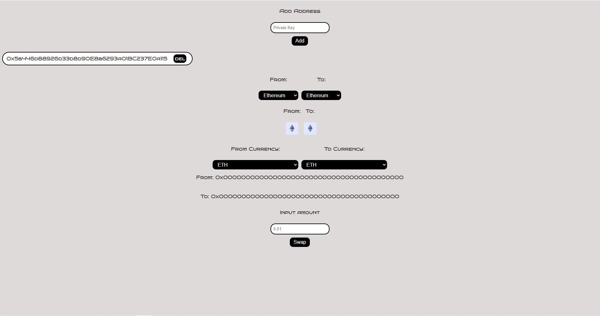

# Getting Started

Update .env
Set ```NEXT_PUBLIC_PUBLIC_MODE=true``` if tou want run in production mode or ```NEXT_PUBLIC_PUBLIC_MODE=false``` if you want start in test mode.

First, run the development server:

```bash
yarn dev
```

Open [http://localhost:3000](http://localhost:3000) with your browser to see the result.

Lifi - [http://localhost:3000](http://localhost:3000)

Stargate - [http://localhost:3000/stargate](http://localhost:3000/stargate)

Stargate working only for native currencies. (Ex: Bridge gEth -> opEth)

Fill form and click swap button. If everything is fine - you will see success notify.
Template for auto swap with @lifi/sdk throw their contracts build with Next.js




# TODO

- [x] Beatify home page
- [x] Multi accounts
- [x] Logger
- [x] Error handler
- [ ] Add orbiter-sdk (https://www.npmjs.com/package/orbiter-sdk)
- [x] Add timeout for repeating swap
- [ ] Cron repeat
- [x] Check LayerZero


